# Arduino配置
json参考：
~~~
http://arduino.esp8266.com/stable/package_esp8266com_index.json
https://arduino.me/packages/esp32.json
https://arduino.me/packages/esp8266.json
https://dl.espressif.com/dl/package_esp32_index.json
https://raw.githubusercontent.com/espressif/arduino-esp32/gh-pages/package_esp32_index.json
~~~

# ESP8266 的部分使用说明
```IO0```引脚接地：代表烧录模式，否则拉高或者悬空代表正常工作模式。
```RESET```:接地代表复位

## 烧录固件问题
注意选择DIO，SPI速率任意，同时记得烧录时一定要将```IO0```引脚接地


## 联动pycharm烧写程序问题
### 终端esptool检测esp8266问题
在pycharm上面使用esptool在终端检测esp8266时同样需要将```IO0```引脚接地；否则检测不到，正确检测结果如图
~~~bash
(D:\SoftWare_TOTAL\Anaconda3\envs\Python_Env\WirelessDataRecieve) PS D:\My_CODE\python_project\WirelessDataRecieve> esptool read_mac
esptool.py v4.8.1
MAC: 48:e7:29:68:e6:ab
Uploading stub...
Running stub...
Stub running...
MAC: 48:e7:29:68:e6:ab
Hard resetting via RTS pin...
(D:\SoftWare_TOTAL\Anaconda3\envs\Python_Env\WirelessDataRecieve) PS D:\My_CODE\python_project\WirelessDataRecieve>
~~~

### 使用MicroPython烧写程序问题
1. 首先烧录micropython的库
地址在这：随便装一个版本就行https://www.micropython.org/download/ESP8266_GENERIC/
2. pycharm配置mciropython
安装教程不细讲了：直接搜索micropython的插件下载就好了，然后将language模式调成enable micropython就好，如下图：
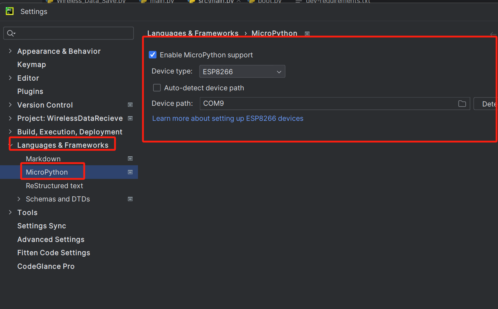
3. 写代码及烧录：
   注意注意！！！！一定将```IO0```引脚拉高或者悬空，因为这时候不需要烧录了！！！！！否则在调试的时候程序会烧录不进去！
   正确效果如下：
   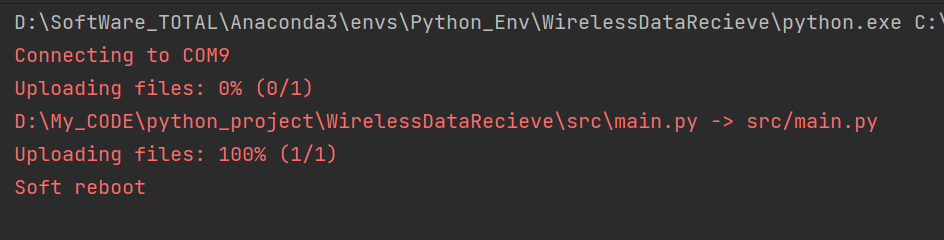

   但是这样子烧录好像没有用，得用REPL，但我的REPL又检测不到（估计是因为杜邦线的问题）
   因此转换思路，使用ampy来烧录，运行的代码为：
   ``` ampy --port COM9 put  .\src\main.py```

   运行成功后，成功烧录了一个呼吸灯

### Micropython运行逻辑
micropython固件包刷到开发板上后，里面是有一个boot.py文件的，而且这个文件不能删除。

开发板上电启动后，会先执行boot.py中的代码，然后才继续执行main.py中代码。后期学习过程中，主要的业务逻辑都会写在main文件中，那咱们就可以把连接wifi代码段放到boot文件中，这样就可以专心调度业务功能了。


## 使用django
### 控制台命令
由于pycharm社区版不支持界面创建django应用，一般使用如下指令：
1. 创建Project：```django-admin startproject project_name```
2. 创建app：```python manage.py startapp app_name```
3. 启动server：```python manage.py runserver 127.0.0.1:8000```

方法三：pycharm社区版实现直接启动
之前说过，原理就是运行manage.py来启动测试服务器，所以只要在configuration里为manage.py添加参数，就可以直接通过右上角绿色的箭头来启动manage.py并运行服务器了！

pycharm界面（如上图）左侧目录里找到manage.py，右键，修改manage.py 的run configuration 里Parameters为runserver

### 数据传输协议
TP查询字符串格式（Query String Format）。这种格式通常用于HTTP GET请求中的URL参数部分，也可以用于POST请求的表单数据。每个参数由键值对组成，键和值之间用等号（=）分隔，多个键值对之间用与号（&）分隔。
>device_id=48:E7:29:68:E6:AB&timestamp=1731499839&data=f1 f2 f3 f4 10 fc f3 1 b5 5e 96 0 5a 63 b5 ff 5 c6 32 0 72 a9 de ff de dd 17 0 32 15 ea ff eb 4f f 0 31 d1 ef ff c0 c1 a 0 e0 e f3 ff 96 a8 8 0 3d 47 f5 ff ca f3 6 0 54 c9 f6 ff 92 a5 5 0 1c d8 f7 ff 8b e7 4 0 1 0 ee 2 a5 e 0 0 ed 4 0 0 2c 3 0 0 62 0 0 0 2d 1 0 0 f0 0 0 0 9b 1 0 0 1f 1 0 0 3e 0 0 0 ed 4 0 0 ff ff ff ff 32 29 0 0 f8 24 1 0 3e 0 0 0 0 0 0 0 c0 2d 0 0 2a 90 0 0 0 0 0 0 1b 3 0 0 17 1d 7 0 a2 1c 2 0 75 8d b 0 df 5 0 0 85 1 6 0 64 22 1a 0 0 0 0 0 32 db b 0 d b 1 0 33 4e 1 0 0 0 0 0 c7 12 0 0 e4 3d 0 0 c6 af 0 0 0 0 0 0 2e 7 0 0 1c e4 e 0 91 ba e 0 15 a4 0 0 cc 72 0 0 f2 4f e 0 1a af 0 0 7e d6 0 0 48 af e 0 3f b2 0 0 68 a9 0 0 ff ff ff 7f ff ff ff 7f f5 f6 f7 f8


### Django 400 错误请求
Django 中的这个错误表示由于语法无效，服务器无法处理客户端发送的请求。

# ESP32使用说明问题
## ESP32 supermini C3 一直断连USB，并且串口输出invalid header: 0xffffffff
出现这个问题说明这个板子现在没有任何固件，需要进行烧录，可以按照下面操作方式进行烧录，也可以按照Q1方式在Arduino烧录
```
首次下载前，需要进行如下操作
1. 断开USB，也就是断电
2. 请将D9与对角线的GND连接
3. 再接上USB
4. 现在就可以正常下载了

下载成功以后，需要进行如下的操作
1. 断开USB,也就是断电
2. 断开D9与GND的链接
3. 再接上USB
4. 现在就能正常运行了
后续再次下载，就不需要再将D9接GND了，可以直接下载了
```

## ESP32 c3 supermini

Arduino配置：```工具 > 开发板 > ESP32 Arduino并选择“ ESP32C3 Dev Module ```
注意！==烧录FlashMode改为DIO==（改不改好像没多大问题）
板载LED蓝灯： ==GPIO8引脚==
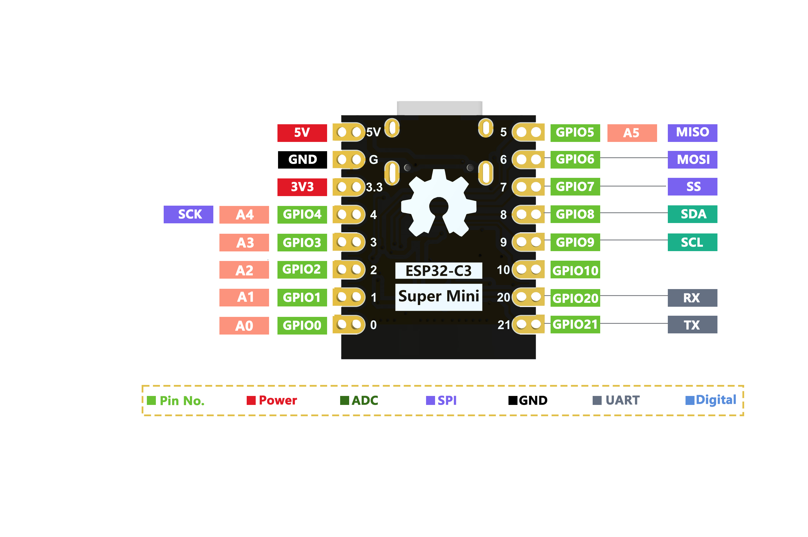

尺寸
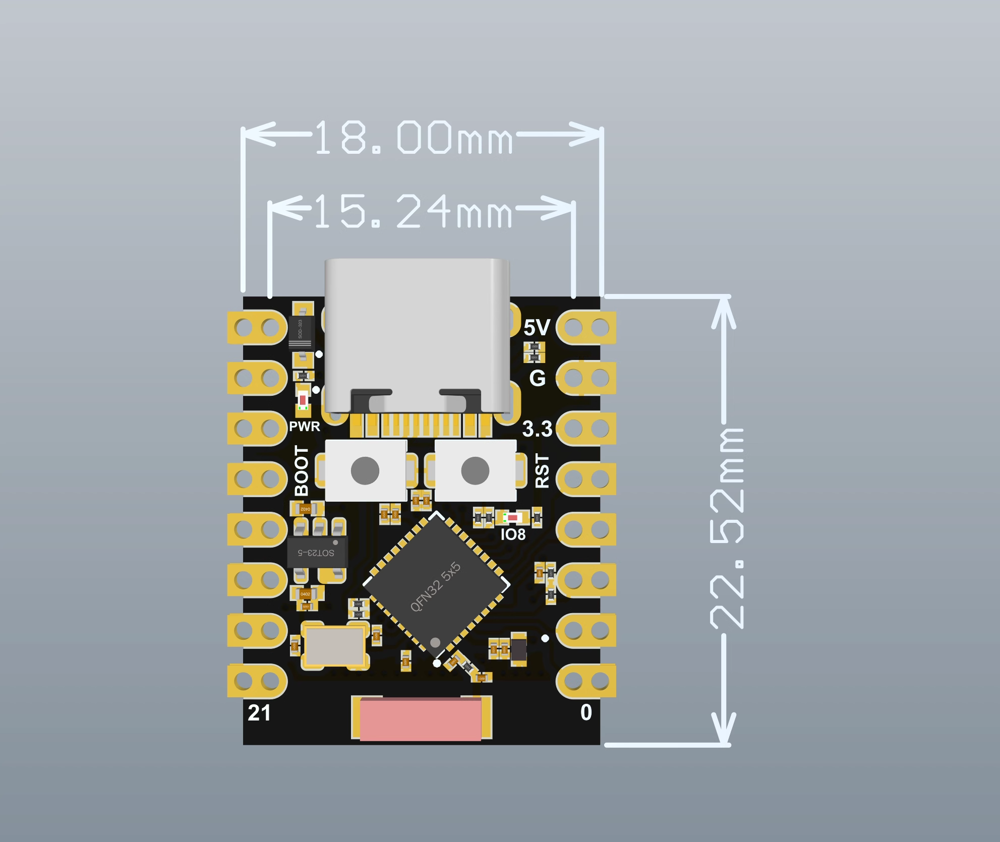
原理图
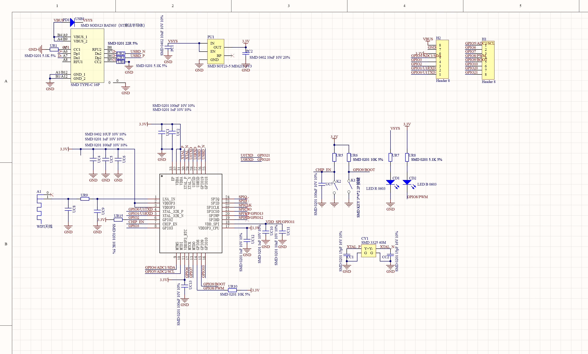
### 外接电源问题！
如果需要外部供电只需将外部电源+级接入5V的位置，GND接负极。（支持3.3～6V电源）。切记连接外部电源的时候，无法接入USB，==USB和外部供电只能选择一个。==
### 烧录程序后重新烧录报错
提示”A fatal error occurred: No serial data received“
一定要进入烧录模式，具体见Q1

### Q1 如何进入下载模式
进入下载模式：方式1：按住BOOT上电。方式2：按住ESP32C3的BOOT按键，然后按下RESET按键，松开RESET按键，再松开BOOT按键，此时ESP32C3会进入下载模式。（每次连接都需要重新进入下载模式，有时按一遍，端口不稳定会断开，可以通过端口识别声音来判断）

### Q2 上传之后程序无法运行
上传成功之后需要按一下Reset按键，才会执行。

### Q3 插上电脑不显示Com口，显示 （JTAG/serial debug unit）
[显示 JTAG/serial debug unit 解决方案](https://chat.nologo.tech/d/72/3)

### Q4 ESP32C3SuperMini Arduino 串口无法打印
需要将工具栏中USB CDC On Boot 设置成Enabled。这一步是必须的！一定的！C3板子不改成Enable不会把usb作为输出串口

#### 设置了USB CDC ON BOOT 为ENABLE还是不能用？烧录时的FlashMode问题或者根本没进入下载模式
1. 一定要进入烧录模式 ，见Q1
2. 烧录FlashMode改为DIO(可选)
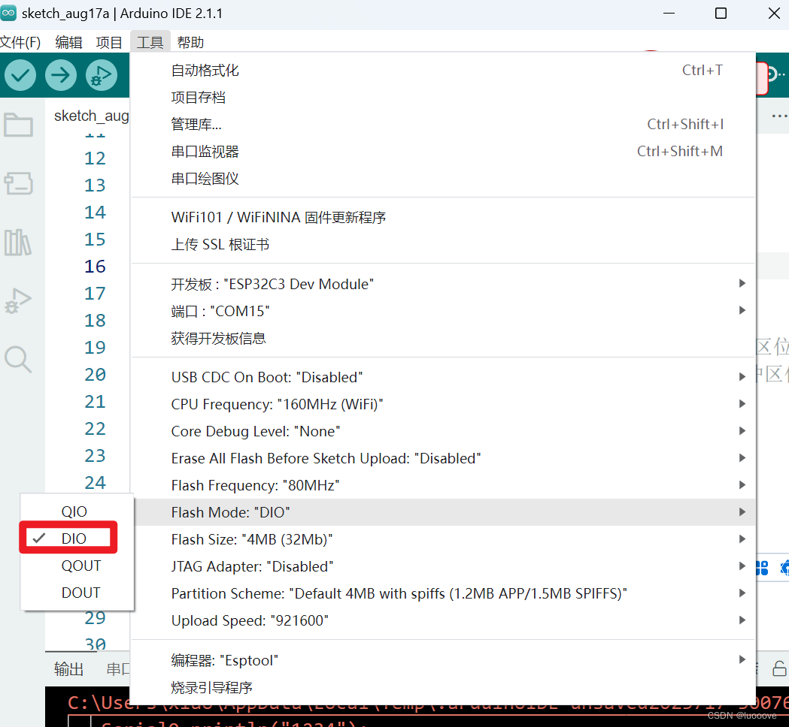

### 有时候检测不到com口？
c3估计是单面typeC，可以插拔USB到c3的接口，换一个面重试一下

### 串口配置Serial 串口
#### 硬串口
板子上有两个硬件串口
* USB串口
* UART串口
  
默认情况下，USB 串行处于启用状态，这意味着您可以通过 USB Type-C 将开发板连接到 PC，并在 Arduino IDE 上打开串行监视器以查看通过串行发送的数据
但是，如果您想==使用 UART 作为串口==，则需要使用 USB 串行适配器将引脚 20 连接为 TX 引脚，将引脚 21 连接为 RX 引脚。
另外，您==需要从 Arduino IDE 将USB CDC On Boot设置为禁用==。

### FreeRTOS问题，同样的程序为什么S3行但是C3mini不行
#### 找不到库问题
~~~c++
// #include <FreeRTOS.h> // ESP32 s3支持 但是esp32c3 mini找不到这个，不知道为什么 
// #include <Arduino.h>
#include <WiFi.h>          
#include <WiFiManager.h>  
#include <HTTPClient.h>
#include <queue>
// #include <task.h>  
~~~
后续将自己安装的freertos卸载了，然后给```FreeRTOS.h```和```task.h```注释了，用官方自带的库就行；原因可能是自带的FreeRTOS和自己在库管理器里面下载的FreeRTOS冲突了
#### 烧录了后很卡的问题-FRERTOS
这款芯片是单核的，160M；用FreeRTOS会卡；开不了几个任务，任务一直在高速循环
ESP32原版是双核的，C3是RiscV单核，S3也是双核的
>解决了，问题出在自己的配置上面的问题，FreeRTOS的优先级是==数字越大优先级越高！！！==
#### FreeRTOS 创建任务时打印不出来消息？
十有八九是任务创建出问题了，排在第一个的任务创建失败，自己查找下原因；可以切换任务的顺序，查看是否能够创建成功别的任务
#### 创建任务的优先级建议设置为同优先级
同优先级任务创建起来稳定一些，参考以下，一开始我的collectDataTask的优先级设置成了2，sendDataTask的优先级设置成了1，导致创建失败，后来改成了全部改为1，创建成功了
>Task create result: 1
Success creating sendDataTask
Task create result: 1
Success creating collectDataTask


# 使用bin文件进行烧录
## 导出bin文件
在arduino中，

* /build 目录下的 bootloader.bin。
* /build 目录下的 partition-table.bin。
* /build 下的 xxx.bin。（用户代码，文件名称与工程相同
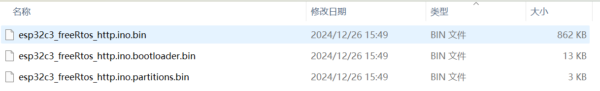

## esptool下载
[乐鑫官网下载烧录软件](https://docs.espressif.com/projects/esp-test-tools/zh_CN/latest/esp32/production_stage/tools/flash_download_tool.html)


* 勾选 DoNotChgBin ，设备将默认使用固件编译时的软件配置
* 不勾选 DoNotChgBin ，设备将会使用固件下载时的 Flash 下载工具配置界面的设置
* CombineBin 是合并固件，固件之间非数据区，会以 0xff 进行填充。合并后的固件默认保存在 Flash Download Tool/combine 目录下，合并固件的下载地址为 0 。
* Default 使用的是系统默认设置的 SPI Flash Config 配置
* Flash 下载固件过程默认不会全擦 Flash ，可以通过 ERASE 按键全擦 Flash

### 烧录配置
Arduino 烧录下载地址
~~~bash
Global variables use 40988 bytes (12%) of dynamic memory, leaving 286692 bytes for local variables. Maximum is 327680 bytes.
"C:\Users\HaoDada\AppData\Local\Arduino15\packages\esp32\tools\esptool_py\4.5.1/esptool.exe" 
--chip esp32c3 --port "COM19" --baud 921600  --before default_reset 
--after hard_reset write_flash  
-z --flash_mode dio --flash_freq 80m --flash_size 4MB 
0x0 
"C:\Users\HaoDada\AppData\Local\Temp\arduino\sketches\3C2D02A8D4E730D3A7860AF28DE1D5AE/esp32c3_freeRtos_http.ino.bootloader.bin" 
0x8000 
"C:\Users\HaoDada\AppData\Local\Temp\arduino\sketches\3C2D02A8D4E730D3A7860AF28DE1D5AE/esp32c3_freeRtos_http.ino.partitions.bin" 
0xe000 
"C:\Users\HaoDada\AppData\Local\Arduino15\packages\esp32\hardware\esp32\2.0.9/tools/partitions/boot_app0.bin" 
0x10000 
"C:\Users\HaoDada\AppData\Local\Temp\arduino\sketches\3C2D02A8D4E730D3A7860AF28DE1D5AE/esp32c3_freeRtos_http.ino.bin" 
~~~
从上面可以知道
地址 ```0x0000``` 烧录 ```bootloader.bin```
地址 ```0x8000``` 烧录 ```partition-table.bin```或者```.partitions.bin```
地址 ```0x10000``` 烧录 ```用户个人程序.bin```
地址 ```0xe000``` 烧录 ```boot_app0.bin``` ；但是经过验证，这个不需要，只需要烧录上面三个即可

最终配置页面：
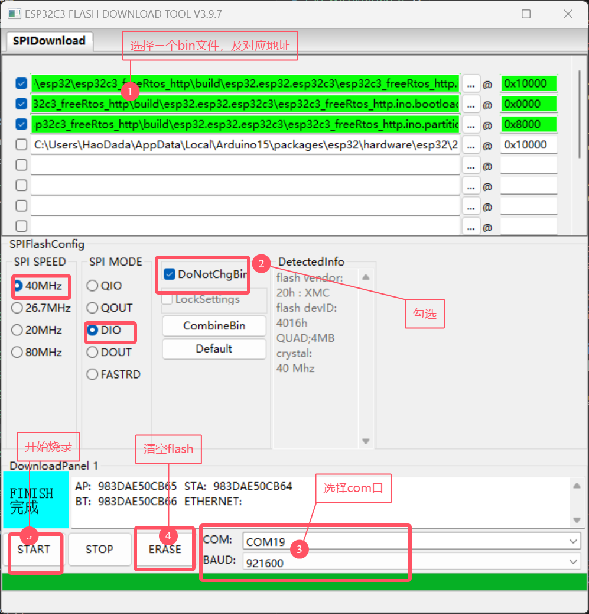
#### 测试了一下如果只烧录build生成的三个文件::没问题
因为我的代码中build后只生成了三个bin，剩下还有一个```esp32\2.0.9\tools\partitions\boot_app0.bin```
测试一下只烧录生成的三个bin会出现什么问题：
烧录的三个bin：
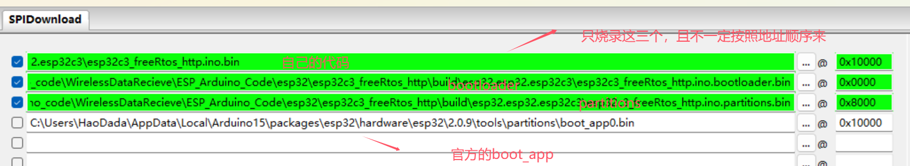
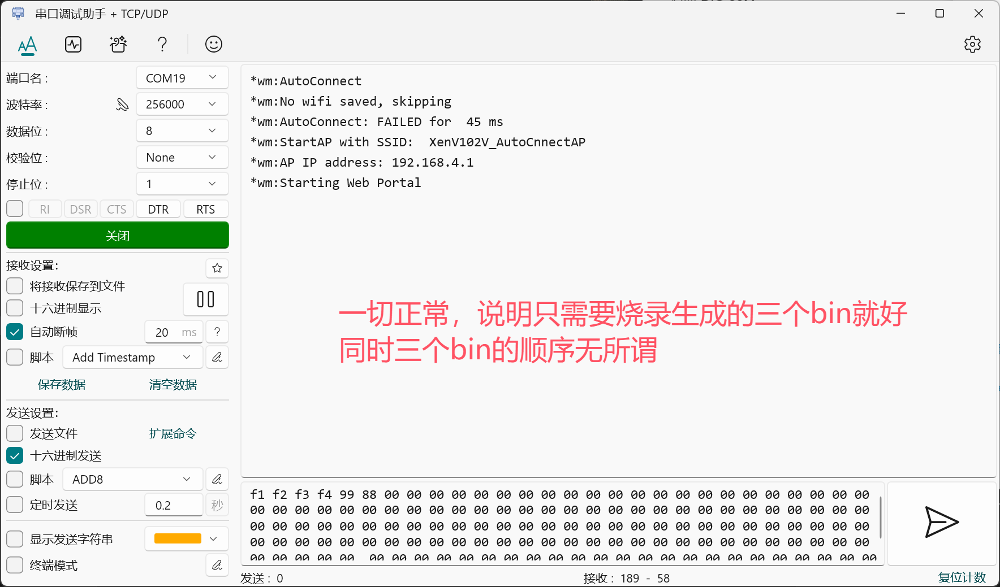
# 外壳设计问题
## fusion360
### 导入stl
有现成的stl但是直接编辑比较困难，stl是实际打印机看到的网格，其上面的曲面是很多三角形模拟的曲面；
需要以下步骤便可转为实体：
```网格 > 准备--生成面族 > 修改--转换网格```
注意转换网格时选择不同的转换可以直接将部分不复杂的面转换为曲面
### 如何画图案
[Fusion360 雕刻图案和避坑](https://www.bilibili.com/video/BV13G411t7jc/?spm_id_from=333.337.search-card.all.click&vd_source=b83e0b7eec8fae554587e9a1ee79dda1)

### 面上的坑怎么办？
直接删除，删除不了的话就选中多个进行删除
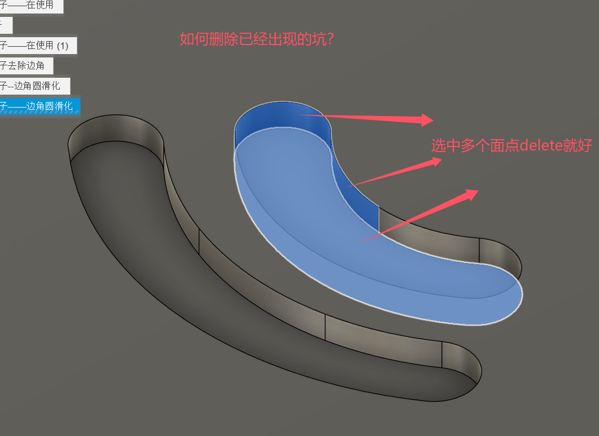