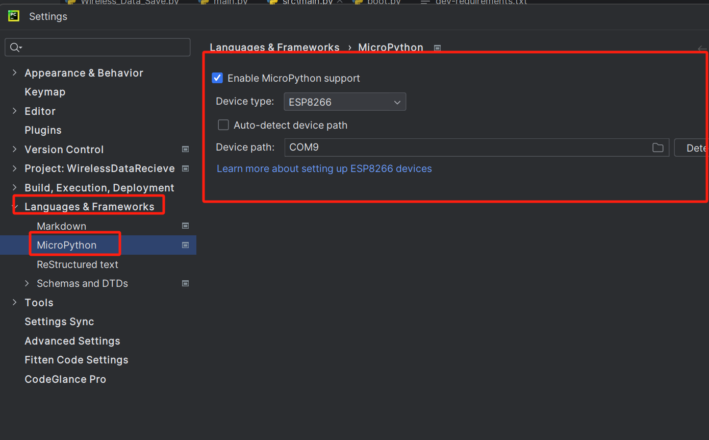
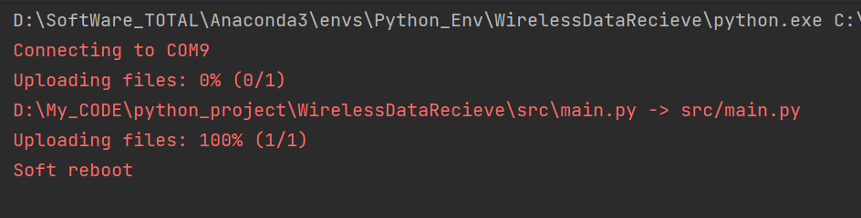

# ESP8266 的部分使用说明
```IO0```引脚接地：代表烧录模式，否则拉高或者悬空代表正常工作模式。
```RESET```:接地代表复位

## 烧录固件问题
注意选择DIO，SPI速率任意，同时记得烧录时一定要将```IO0```引脚接地


## 联动pycharm烧写程序问题
### 终端esptool检测esp8266问题
在pycharm上面使用esptool在终端检测esp8266时同样需要将```IO0```引脚接地；否则检测不到，正确检测结果如图
~~~bash
(D:\SoftWare_TOTAL\Anaconda3\envs\Python_Env\WirelessDataRecieve) PS D:\My_CODE\python_project\WirelessDataRecieve> esptool read_mac
esptool.py v4.8.1
MAC: 48:e7:29:68:e6:ab
Uploading stub...
Running stub...
Stub running...
MAC: 48:e7:29:68:e6:ab
Hard resetting via RTS pin...
(D:\SoftWare_TOTAL\Anaconda3\envs\Python_Env\WirelessDataRecieve) PS D:\My_CODE\python_project\WirelessDataRecieve>
~~~

### 使用MicroPython烧写程序问题
1. 首先烧录micropython的库
地址在这：随便装一个版本就行https://www.micropython.org/download/ESP8266_GENERIC/
2. pycharm配置mciropython
安装教程不细讲了：直接搜索micropython的插件下载就好了，然后将language模式调成enable micropython就好，如下图：

3. 写代码及烧录：
   注意注意！！！！一定将```IO0```引脚拉高或者悬空，因为这时候不需要烧录了！！！！！否则在调试的时候程序会烧录不进去！
   正确效果如下：
   

   但是这样子烧录好像没有用，得用REPL，但我的REPL又检测不到（估计是因为杜邦线的问题）
   因此转换思路，使用ampy来烧录，运行的代码为：
   ``` ampy --port COM9 put  .\src\main.py```

   运行成功后，成功烧录了一个呼吸灯

### Micropython运行逻辑
micropython固件包刷到开发板上后，里面是有一个boot.py文件的，而且这个文件不能删除。

开发板上电启动后，会先执行boot.py中的代码，然后才继续执行main.py中代码。后期学习过程中，主要的业务逻辑都会写在main文件中，那咱们就可以把连接wifi代码段放到boot文件中，这样就可以专心调度业务功能了。


## 使用django
### 控制台命令
由于pycharm社区版不支持界面创建django应用，一般使用如下指令：
1. 创建Project：```django-admin startproject project_name```
2. 创建app：```python manage.py startapp app_name```
3. 启动server：```python manage.py runserver 127.0.0.1:8000```

方法三：pycharm社区版实现直接启动
之前说过，原理就是运行manage.py来启动测试服务器，所以只要在configuration里为manage.py添加参数，就可以直接通过右上角绿色的箭头来启动manage.py并运行服务器了！

pycharm界面（如上图）左侧目录里找到manage.py，右键，修改manage.py 的run configuration 里Parameters为runserver

### 数据传输协议
TP查询字符串格式（Query String Format）。这种格式通常用于HTTP GET请求中的URL参数部分，也可以用于POST请求的表单数据。每个参数由键值对组成，键和值之间用等号（=）分隔，多个键值对之间用与号（&）分隔。
>device_id=48:E7:29:68:E6:AB&timestamp=1731499839&data=f1 f2 f3 f4 10 fc f3 1 b5 5e 96 0 5a 63 b5 ff 5 c6 32 0 72 a9 de ff de dd 17 0 32 15 ea ff eb 4f f 0 31 d1 ef ff c0 c1 a 0 e0 e f3 ff 96 a8 8 0 3d 47 f5 ff ca f3 6 0 54 c9 f6 ff 92 a5 5 0 1c d8 f7 ff 8b e7 4 0 1 0 ee 2 a5 e 0 0 ed 4 0 0 2c 3 0 0 62 0 0 0 2d 1 0 0 f0 0 0 0 9b 1 0 0 1f 1 0 0 3e 0 0 0 ed 4 0 0 ff ff ff ff 32 29 0 0 f8 24 1 0 3e 0 0 0 0 0 0 0 c0 2d 0 0 2a 90 0 0 0 0 0 0 1b 3 0 0 17 1d 7 0 a2 1c 2 0 75 8d b 0 df 5 0 0 85 1 6 0 64 22 1a 0 0 0 0 0 32 db b 0 d b 1 0 33 4e 1 0 0 0 0 0 c7 12 0 0 e4 3d 0 0 c6 af 0 0 0 0 0 0 2e 7 0 0 1c e4 e 0 91 ba e 0 15 a4 0 0 cc 72 0 0 f2 4f e 0 1a af 0 0 7e d6 0 0 48 af e 0 3f b2 0 0 68 a9 0 0 ff ff ff 7f ff ff ff 7f f5 f6 f7 f8


### Django 400 错误请求
Django 中的这个错误表示由于语法无效，服务器无法处理客户端发送的请求。

